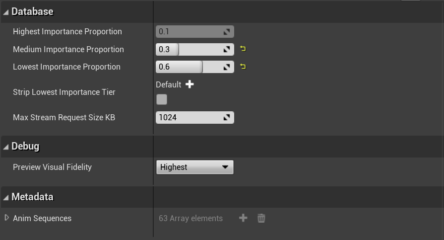
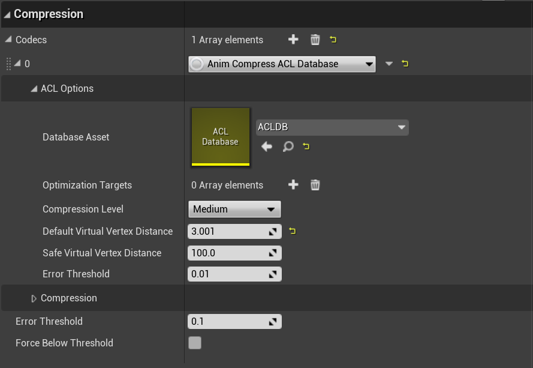
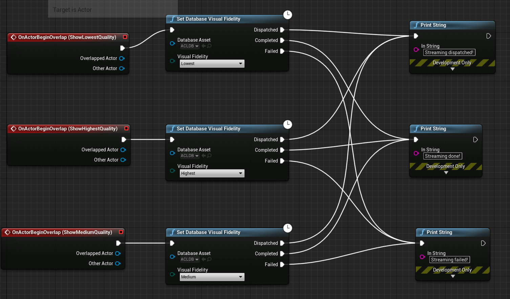
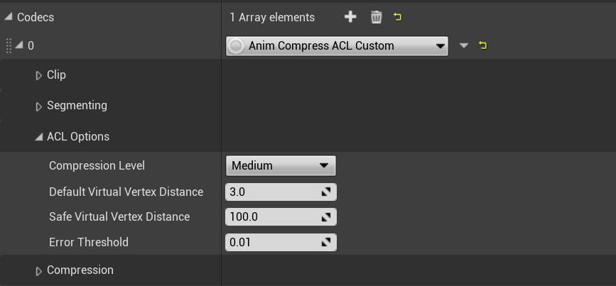
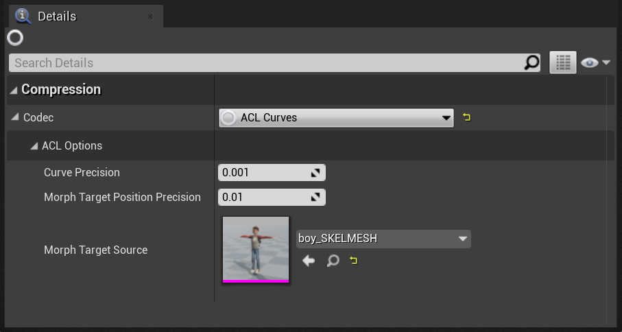

# Documentation

## Engine integration

Starting with UE 4.25, the engine natively supports an animation compression codec interface suitable for plugins. This allows the *ACL Plugin v1.0.0* (and up) to function as-is with no custom engine changes straight from the Unreal Marketplace or from GitHub. Here are the necessary steps in order to use the plugin directly from GitHub:

*  Clone the *develop* branch and its sub-modules with: `git clone --recurse-submodules https://github.com/nfrechette/acl-ue4-plugin.git`
*  Grab the `ACLPlugin` directory located here: [acl-ue4-plugin/ACLPlugin](../ACLPlugin) and copy it under `UE4 Root\Engine\Plugins` or in the plugin directory of your project.
*  Update the UE4 solution with the `GenerateProjectFiles.bat` or the equivalent file for your OS. The ACL plugin contains code that needs to be built for the editor and the runtime.
*  Open and build the editor.

Once you start the editor, you should see the ACL Plugin in the plugin list under `Edit -> Plugins` in the top menu bar. Make sure it is enabled for your project and reload the editor if needed.

*See [here](pre_4_25_integration.md) for further instructions when integrating the ACL Plugin in UE 4.24 and earlier.*

### How to use animation compression codecs in UE4

Compression codecs are data driven much like other assets in the engine. Animation sequences reference a `Bone Compression Settings` asset that can be created in the content browser by right-clicking and selecting it under the `Animation` category. A compression settings asset is responsible for referencing a list of codecs to try when compression is requested. Each codec is tried in parallel and the best one is selected by the same heuristic that the old `Automatic Compression` relied on (in UE 4.24 and earlier). The list of codecs that `Automatic Compression` used to reference can now be found in the default compression settings asset located under `Engine Content/Animation` (note that you will need enable the `Show Engine Content` option in the `View Options` to see it). It contains the same codecs that UE 4.24 and earlier used.

The ACL plugin also provides its own compression settings assets located in its plugin content folder (note that you will need to enable the `Show Plugin Content` option in the `View Options` to see it). It contains only the ACL codec and can be used out of the box in all your animation sequences.

### How to change the default compression codec

In order to change the default compression settings asset used, you will need to edit the `BaseEngine.ini` or the equivalent file in your project under the `[Animation.DefaultObjectSettings]` section. The relevant entry is this one: `BoneCompressionSettings="/Engine/Animation/DefaultAnimBoneCompressionSettings"`. It points to an asset under *Engine Content*. You can change it to point to any other suitable asset of your choice. You can also modify that asset to add ACL. Note that if you wish to point to your own asset that lives in your project, the path should look like this: `BoneCompressionSettings="/Game/Foo/MySettings"` for a file located here: `.../MyProject/Content/Foo/MySettings.uasset`.

*The process is identical for the default curve compression codec: `CurveCompressionSettings="/Game/Foo/MyCurveSettings"` in the same INI file and the same section.*

## Bone compression settings

All units are in centimeters (the UE4 default), and as such if you use different units you will need to change the default thresholds and values to take this into account.

ACL tries very hard to be as safe as possible and as such very few things require tuning. It is recommended to use the `Anim Compress ACL` codec which uses the optimal settings behind the scene. If you need more power or wish to explore, you can opt to use the `Anim Compress Custom ACL` codec which allows you to tweak everything.

### Anim Compress ACL

Internally, the optimal and recommended settings will be used. Very little tweaking is required and only the absolute minimum is exposed for simplicity and safety.

The ACL [error metric](https://github.com/nfrechette/acl/blob/develop/docs/error_metrics.md) simulates virtual vertices at a fixed distance from each and every bone. This is meant to approximate the visual mesh. Choosing an appropriate value for the *Default Virtual Vertex Distance* is important. The default value of **3cm** is generally suitable for ordinary characters but large objects or exotic characters might require fine tuning. UE4 also has support for special bones that require more accuracy. By default, every bone that has a socket attached will be deemed as needing high accuracy as well as any bone that contains one of the substrings present in `UAnimationSettings::KeyEndEffectorsMatchNameArray`. Common substrings included are: *hand, eye, IK, camera, etc*. For those special bones, the *Safe Virtual Vertex Distance* is used instead.

The ACL optimization algorithm will attempt to aggressively remove everything it can until the error exceeds a specified *Error Threshold*. For this reason, the threshold is very important and it should be very conservative. A default value of **0.01cm** is appropriate for cinematographic quality and most likely does not require any tuning. The error threshold works in conjunction with the virtual vertex distance since the error is measured on the virtual vertices.

The compression level dictates how aggressively ACL tries to optimize the memory footprint. Higher levels will yield a smaller memory footprint but take longer to compress while lower levels will compress faster with a larger memory footprint. *Medium* strikes a good balance and is suitable for production use.

Despite the best efforts of ACL, some exotic animation sequences will end up having an unacceptably large error, and when this happens, it will attempt to fall back to safer settings. This should happen extremely rarely if the virtual vertex distances are properly tuned. In order to control this behavior, a threshold is provided to control when it kicks in (the behavior can be disabled if you set the threshold to **0.0**). As ACL improves over time, the fallback might become obsolete.

**Bind pose options are EXPERIMENTAL, see below**

Animation sequences, when compressed, are fully independent. They contain everything needed to be able to be decompressed in order to reconstruct (approximately) the original animation. This can lead to a lot of redundant information being stored when many animations reference a single skeleton. By design, Unreal Engine forces codecs to retain compressed data for joints that aren't animated even if they are equal to the bind pose. ACL offers an option to strip this redundant data as it can be reconstructed fromm the skeleton at runtime. Depending on the data, this can save up to **2-5%** on the overall memory footprint. However, there is a caveat: **only bones not individually decompressed at runtime can be stripped**. Generally speaking, only the root bone is individually decompressed at runtime and through normal blending operations the whole pose is decompressed as a whole. When the whole pose is decompressed, Unreal Engine pre-fills the output pose buffer with the bind pose which is what allows ACL to strip this data. Sadly the same isn't currently possible when individual bones are decompressed. As such, their value cannot be reconstructed at runtime if it is stripped (outside the editor). If this happens, an error will be shown in the log in non-shipping cooked builds. If you see this error, you will have to find the offending bone and add it to the exclusion list (the root bone is automatically excluded). Note that ACL caches the bind pose for every animation sequence in the editor to be able to safely reconstruct stripped values.

Note that while stripping the bind pose generally leads to a smaller memory footprint with no loss of visual quality, some exotic clips can end up with either a higher error or a higher memory footprint. As such, it is recommended to include the normal ACL codec as part of the settings asset so that both codecs can be tried in parallel. The Unreal Engine heuristic will safely pick the best. A future version of ACL may improve on this to avoid such scenarios.

### Anim Compress ACL Database

This codec exposes quality based streaming. This is explained [here](https://nfrechette.github.io/2021/01/17/progressive_animation_streaming/).

To set things up, first create a new database asset from the Content Browser: *Animation -> ACL Database*.

A database asset references all the animation sequences that will be part of it automatically. It contains a few settings:

* Highest Importance Proportion: Percentage of animation data that remains always loaded in memory (the most important key frames).
* Medium Importance Proportion: Percentage of animation data that is moved into the streamable medium tier.
* Low Importance Proportion: Percentage of animation data that is moved into the streamable lowest tier.
* Strip Lowest Importance Tier: Whether or not to strip entirely the lowest tier (once stripped, it cannot be streamed).
* Max Stream Request Size KB: Maximum IO stream request size (small reads perform more poorly and should be avoided).
* Preview Visual Fidelity: Which visual fidelity level to use for preview in the editor (editor only, transient).

All three proportion fields must sum to **1.0**.

The preview visual fidelity field is meant to help preview in the editor what the animation quality will be once data is streamed at a particular fidelity level. By default, the editor always shows the highest visual fidelity.

Once your database asset is configured, it needs to be referenced by a database enabled codec.

This codec is identical to the default one described above with the addition of the database field. Multiple codecs can reference the same database assets. Animation sequences that use this codec will end up in the selected database and can have their data streamed at runtime or stripped entirely during cook.

Frame stripping with ACL is much more powerful than the UE4 frame stripping. ACL allows you to control how much data you want to strip and it will pick the least important key frames from all animations within the database. This means that some sequences might retain more key frames than others if they are more important. As such, this is far less destructive as we can globally optimize across many sequences.

In a cooked build, no data will be streamed by default. The default visual fidelity level is at its lowest. In order to increase it, data must be streamed. This is exposed through the blueprint interface.

You can find the blueprint nodes under: *Animation -> ACL*.

The visual fidelity can be queried and set through ordinary latent blueprint nodes. By setting the desired fidelity level, ACL figures out what needs to be streamed in or out. If multiple change request come in while streaming is in progress, they will be queued and execute once everything else queued prior has completed. It is not currently possible to interrupt a fidelity change request.

When the visual fidelity changes, memory is allocated and freed on demand to accommodate the request. Data is loaded from disk asynchronously.

### Anim Compress ACL Custom

Using the custom codec allows you to tweak and control every aspect of ACL. These are provided mostly for debugging purposes. In production, it should never be needed but if you do find that to be the case, please reach out so that we can investigate and fix this issue. Note that as a result of supporting every option possible, decompression can often end up being a bit slower (less code is stripped by the compiler).

The default values are the ones being used by `Anim Compress ACL`.

#### ACL Options

The ACL [error metric](https://github.com/nfrechette/acl/blob/develop/docs/error_metrics.md) simulates virtual vertices at a fixed distance from each and every bone. This is meant to approximate the visual mesh and, as such, choosing an appropriate value for the *Default Virtual Vertex Distance* is important. The default value of **3cm** is generally suitable for ordinary characters but large objects or exotic characters might require fine tuning. UE4 also has support for special bones that require more accuracy. By default, every bone that has a socket attached will be deemed as needing high accuracy as well as any bone that contains one of the substrings present in `UAnimationSettings::KeyEndEffectorsMatchNameArray`. Common substrings included are: *hand, eye, IK, camera, etc*. For those special bones, the *Safe Virtual Vertex Distance* is used instead.

The ACL optimization algorithm will attempt to aggressively remove everything it can until the error exceeds a specified *Error Threshold*. For this reason, the threshold is very important and it should be very conservative. A default value of **0.01cm** is appropriate for cinematographic quality and most likely does not require any tuning. The error threshold works in conjunction with the virtual vertex distance since the error is measured on the virtual vertices.

The compression level dictates how aggressively ACL tries to optimize the memory footprint. Higher levels will yield a smaller memory footprint but take longer to compress while lower levels will compress faster with a larger memory footprint. *Medium* strikes a good balance and is suitable for production use.

#### Clip

This plugin supports three rotation formats: *Quat Full Bit Rate, Quat Drop W Full Bit Rate, and Quat Drop W Variable Bit rate (default)*. The variable bit rate is almost always the best choice which is why it is the default. The other two options are used by the safety fallback and for debugging purposes.

For translation and scale tracks, the plugin supports two vector formats: *Vector3 Full Bit Rate and Vector3 Variable Bit Rate (default)*. Here again the variable bit rate is the ideal choice and the other option is provided for debugging purposes.

Three boolean flags are provided to control the range reduction of each track type. These are provided for debugging purposes.

#### Segmenting

ACL splits animation sequences into smaller segments and compresses those independently. A boolean flag is provided to control this behavior but it rarely is a good idea to disable it.

Three boolean flags are also provided to control the per segment range reduction for debugging purposes.

Two values control how segments are partitioned: *Ideal Num Key Frames Per Segment and Max Num Key Frames Per Segment*. ACL will attempt to have segments of the ideal number of key frames while never exceeding the maximum value provided. The default values are sensible and should be suitable for everyday use.

### UE4 reports a high bone compression error, how come?

In rare cases UE4 can report a high compression error with the ACL plugin. To better understand why, make sure to read [how error is measured](error_measurements.md).

## Curve compression settings

The `Curve Compression Settings` assets behave more or less the same as they do with bones but there is only a single codec specified and used. ACL exposes a few options:

* **Curve Precision**: This is the desired precision to retain for ordinary curves (**0.001** is the default).
* **Morph Target Position Precision**: This is the desired precision of morph target curves in world space units (e.g. centimeters are used by default in UE4). This guarantees that morph target deformations meet the specified precision value (**0.01 cm** is the default). This is only enabled and used if a `Morph Target Source` is specified.
* **Morph Target Source**: This is the skeletal mesh to lookup the morph targets from when compressing curves. If a curve is mapped to a morph target, the `Morph Target Position Precision` will be used and if it isn't, the `Curve Precision` will be used instead.

Using the `Morph Target Source` isn't required but it does improve the compression ratio significantly. The reference to the skeletal mesh is stripped during cooking and it will not be used at runtime: it is only used during compression. The skeletal mesh does not have to match the real one used at runtime but ideally it has to reasonably approximate the morph target deformations. As such, a preview mesh is suitable here.

## Performance metrics

*  [Carnegie-Mellon University database performance](cmu_performance.md)
*  [Paragon database performance](paragon_performance.md)
*  [Matinee fight scene performance](fight_scene_performance.md)
*  [A Boy and His Kite](a_boy_and_his_kite.md)
*  [Decompression performance](decompression_performance.md)

## ACL Plugin playground

In order to test and play with the ACL Plugin, a playground was created where every single animation from the [animation starter pack](https://www.unrealengine.com/marketplace/animation-starter-pack) is playing simultaneously. A zip file can be found [here](https://drive.google.com/open?id=16RjH5_HwdrjekeCwgNojsdGanbfzFD2H). Note that you will need to run it under UE 4.25 (or higher) with the ACL Plugin installed.
