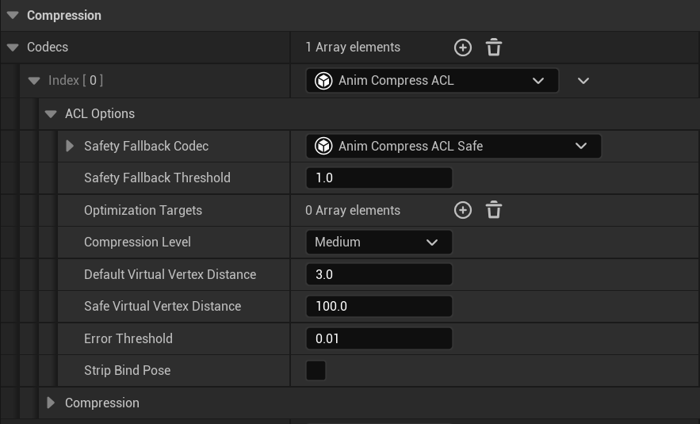
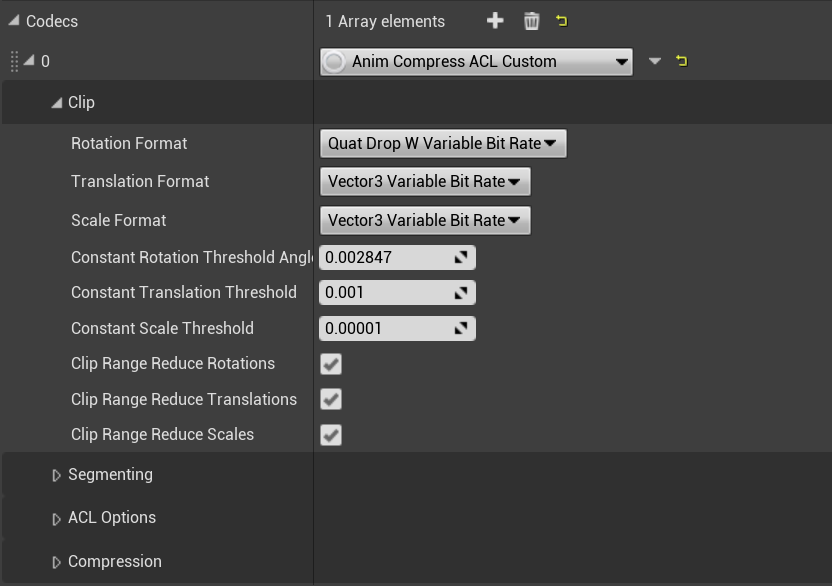
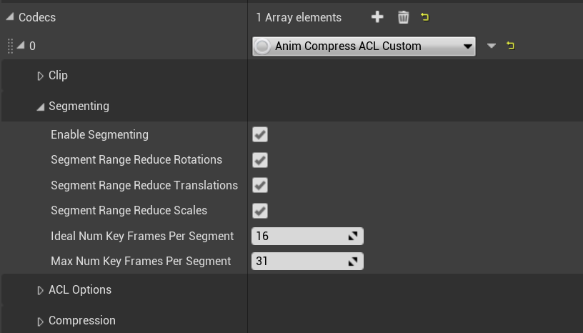

# Documentation

## Engine integration

In order to use the ACL plugin in *Unreal Engine 4.23* and earlier, you will need to manually integrate a few engine changes. These changes can be found in the following *GitHub* branches:

*  **4.19.x:** [branch](https://github.com/nfrechette/UnrealEngine/tree/4.19-acl) - [patch](https://github.com/nfrechette/UnrealEngine/pull/3.patch) (requires ACL plugin **v0.3 or earlier**)
*  4.20.x: Use 4.19.x for inspiration, few to no engine changes should conflict (requires ACL plugin **v0.3 or earlier**)
*  4.21.x: Use 4.22.x for inspiration, few to no engine changes should conflict (requires ACL plugin **v0.4**)
*  **4.22.x:** [branch](https://github.com/nfrechette/UnrealEngine/tree/4.22-acl) - [patch](https://github.com/nfrechette/UnrealEngine/pull/4.patch) (requires ACL plugin **v0.4**)
*  **4.23.x:** [branch](https://github.com/nfrechette/UnrealEngine/tree/4.23-acl) - [patch](https://github.com/nfrechette/UnrealEngine/pull/5.patch) (requires ACL plugin **v0.5**)
*  **4.24.x:** Use 4.23.x for inspiration, few to no engine changes should conflict (requires ACL plugin **v0.5**)

Note that in order to see these, you will first need to [request access](https://www.unrealengine.com/en-US/ue4-on-github) to the *Unreal Engine* source code.

The changes are fairly minimal and consist of a global registry for animation codecs that plugins can hook into as well as some engine bug fixes. The branches themselves do not contain the ACL plugin. You will have to download the sources and place the `ACLPlugin` directory under `UE4 Root\Engine\Plugins` or your project's plugin directory.

## ACL plugin playground

In order to test and play with the ACL Plugin, a playground was created where every single animation from the [animation starter pack](https://www.unrealengine.com/marketplace/animation-starter-pack) is playing simultaneously. A zip file can be found [here](https://drive.google.com/open?id=1m917lmF6rYCfIUAKA7wbRHl9vHNAR_6O). Note that you will need to run it with the above engine modifications as well as the ACL Plugin.

## Compression settings

All units are in centimeters (the UE4 default), and as such if you use different units you will need to change the default thresholds and values to take this into account.

ACL tries very hard to be as safe as possible and as such very few things require tuning. It is recommended to use the `Anim Compress ACL` compression settings which uses the optimal settings behind the scene. If you need more power or wish to explore, you can opt to use the `Anim Compress Custom ACL` compression settings which allow you to tweak everything (note that the decompression performance of the custom codec can be slower than the others).

### Anim Compress ACL

Internally, the optimal and recommended settings will be used. Very little tweaking is required and only the absolute minimum is exposed for simplicity and safety.

The ACL [error metric](https://github.com/nfrechette/acl/blob/develop/docs/error_metrics.md) simulates virtual vertices at a fixed distance from each and every bone. This is meant to approximate the visual mesh and, as such, choosing an appropriate value for the *Default Virtual Vertex Distance* is important. The default value of **3cm** is generally suitable for ordinary characters but large objects or exotic characters might require fine tuning. UE4 also has support for special bones that require more accuracy. By default, every bone that has a socket attached will be deemed as needing high accuracy as well as any bone that contains one of the substrings present in `UAnimationSettings::KeyEndEffectorsMatchNameArray`. Common substrings included are: *hand, eye, IK, camera, etc*. For those special bones, the *Safe Virtual Vertex Distance* is used instead.

Despite the best efforts of ACL, some exotic animation sequences will end up having an unacceptably large error, and when this happens, it will attempt to fall back to safer settings. This should happen extremely rarely if the virtual vertex distances are properly tuned. In order to control this behavior, a threshold is provided to control when it kicks in (the behavior can be disabled if you set the threshold to **0.0**). As ACL improves over time, the fallback might become obsolete.

### Anim Compress Custom ACL

Using the `Custom ACL` compression settings allows you to tweak and control every aspect of ACL. These are provided mostly for the curious and debugging purposes. In production, it should never be needed but if you do find that to be the case, please reach out so that we can investigate and fix this issue. Note that as a result of supporting every option possible, decompression can often end up being a bit slower.

The default values are the ones being used by `Anim Compress ACL`.

#### Skeleton

The ACL [error metric](https://github.com/nfrechette/acl/blob/develop/docs/error_metrics.md) simulates virtual vertices at a fixed distance from each and every bone. This is meant to approximate the visual mesh and, as such, choosing an appropriate value for the *Default Virtual Vertex Distance* is important. The default value of **3cm** is generally suitable for ordinary characters but large objects or exotic characters might require fine tuning. UE4 also has support for special bones that require more accuracy. By default, every bone that has a socket attached will be deemed as needing high accuracy as well as any bone that contains one of the substrings present in `UAnimationSettings::KeyEndEffectorsMatchNameArray`. Common substrings included are: *hand, eye, IK, camera, etc*. For those special bones, the *Safe Virtual Vertex Distance* is used instead.

#### Clip

The ACL optimization algorithm will attempt to aggressively remove everything it can until the error exceeds a specified *Error Threshold*. For this reason, the threshold is very important and it should be very conservative. A default value of **0.01cm** is appropriate for cinematographic quality and most likely does not require any particular tuning. The error threshold works in conjunction with the virtual vertex distance since the error is measured on the virtual vertices.

This plugin supports three rotation formats: *Quat Full Bit Rate, Quat Drop W Full Bit Rate, and Quat Drop W Variable Bit rate (default)*. The variable bit rate is almost always the best choice which is why it is the default. The other two options are used by the safety fallback and for debugging purposes.

For translation and scale tracks, the plugin supports two vector formats: *Vector3 Full Bit Rate and Vector3 Variable Bit Rate (default)*. Here again the variable bit rate is the ideal choice and the other option is provided for debugging purposes.

Three boolean flags are provided to control the range reduction of each track type. These are provided for debugging purposes.

#### Segmenting

ACL splits animation sequences into smaller segments and compresses those independently. A boolean flag is provided to control this behavior but it rarely is a good idea to disable it.

Three boolean flags are also provided to control the per segment range reduction for debugging purposes.

Two values control how segments are partitioned: *Ideal Num Key Frames Per Segment and Max Num Key Frames Per Segment*. ACL will attempt to have segments of the ideal number of key frames while never exceeding the maximum value provided. The default values are sensible and should be suitable for everyday use.

## UE4 reports a high compression error, how come?

In rare cases UE4 can report a high compression error with the ACL plugin. To better understand why, make sure to read [how error is measured](error_measurements.md).

## Performance metrics

*  [Carnegie-Mellon University database performance](cmu_performance.md)
*  [Paragon database performance](paragon_performance.md)
*  [Matinee fight scene performance](fight_scene_performance.md)
*  [Decompression performance](decompression_performance.md)
