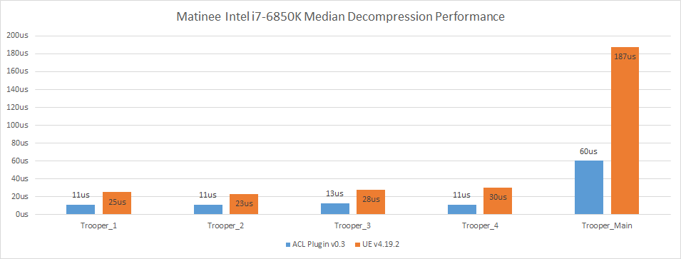
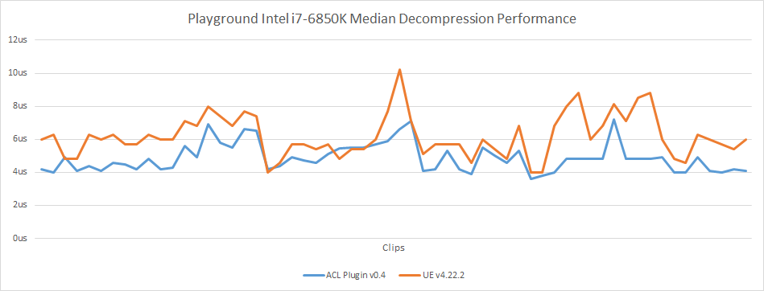
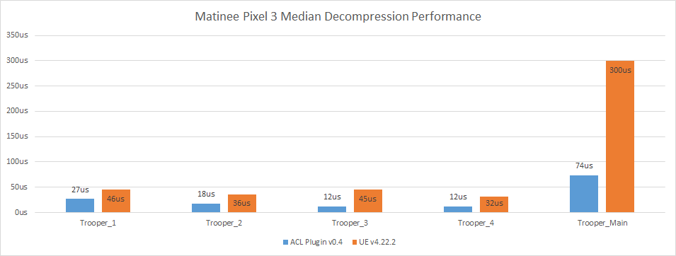
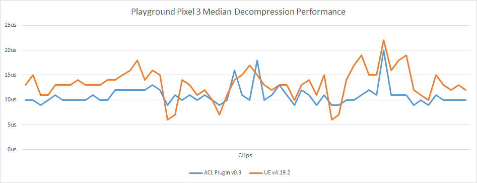
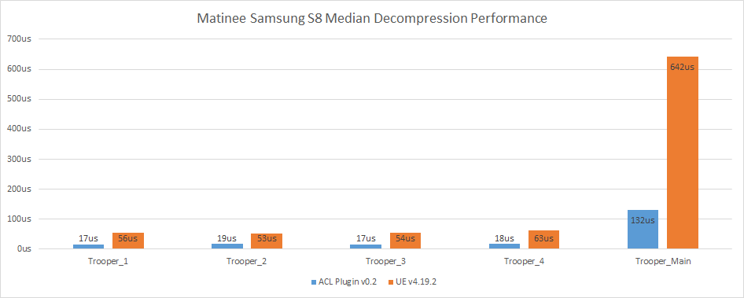
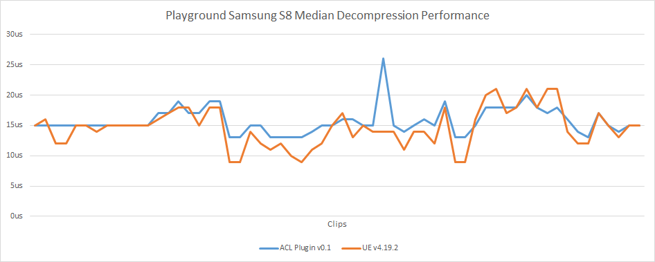

# Decompression performance

## Intel i7-6850K @ 3.8 GHz (x64)

## Google Pixel 3 @ 2.5 GHz (arm64)

## Samsung S8 @ 2.3 GHz (arm64)

## Data and method used

In order to extract the decompression performance statistics, *UAnimSequence* is instrumented to output in the log how long it takes to sample everything. You can enable the logging by setting the define `ACL_ENABLE_UE4_DECOMP_STAT_LOGGING` to **1**.

A simple [python script](../Tools/clean_log.py) is then used to clean up the log and generate a CSV file.

Two scenarios are tracked:

*  [The Matinee fight scene](https://github.com/nfrechette/acl/blob/develop/docs/fight_scene_performance.md)
*  A [playground](./README.md#acl-plugin-playground) with every animation of the [animation starter pack](https://www.unrealengine.com/marketplace/animation-starter-pack) playing simultaneously

All the performance metrics were extracted with a **Development** build. This might be a bit slower than the performance you might see under a **Shipping** configuration but not by much.

The playground represents a worst case for ACL because the skeleton used discards almost every translation from the animation sequences taking it instead from the skeleton. This forces ACL to perform some unnecessary work.

On the other hand, the Matinee fight scene shows how well ACL scales when the number of bones increases.

