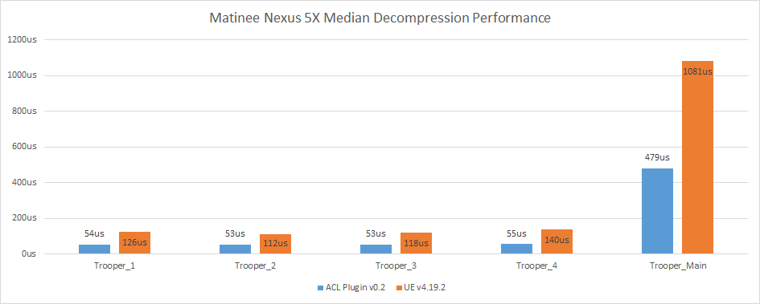

# Decompression performance

## Intel i7-6850K @ 3.8 GHz

## Google Nexus 5X @ 1.8 GHz

## Samsung S8 @ 2.3 GHz

## Data and method used

In order to extract the decompression performance statistics, *UAnimSequence* is instrumented to output in the log how long it takes to sample every track. You can enable the logging by setting the define `ACL_ENABLE_UE4_DECOMP_STAT_LOGGING` to **1**.

A simple [python script](../Tools/clean_log.py) is then used to clean up the log and generate a CSV file.

Two scenarios are tracked:

*  [The matinee fight scene](https://github.com/nfrechette/acl/blob/develop/docs/fight_scene_performance.md)
*  A [playground](./README.md#acl-plugin-playground) with every animation of the [animation starter pack](https://www.unrealengine.com/marketplace/animation-starter-pack) playing simultaneously

All the performance metrics were extracted with a **Development** build. This might be a bit slower than the performance you might see under a **Shipping** configuration.
