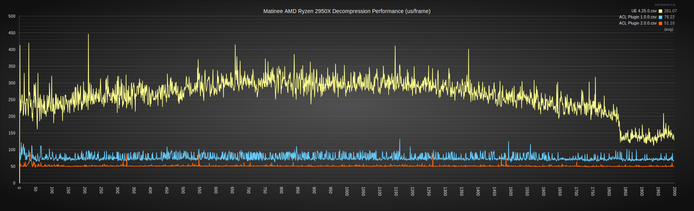
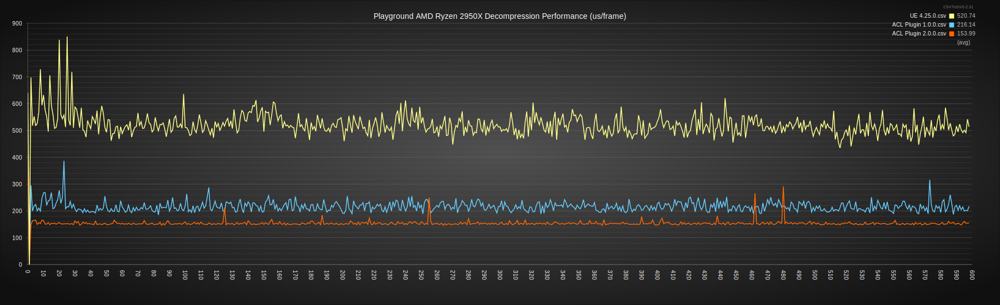

# Decompression performance

## AMD Ryzen 2950X @ 3.5 GHz (x64)

## Google Pixel 7 @ 2.85 GHz (arm64)

## Observations

A number of interesting things can be seen in the above graphs. ACL is *much* faster. The variance is also much lower as decompression performance remains consistent from frame to frame. As a result, fewer spikes can be seen with ACL.

The Matinee fight scene also shows how UE searches for keys when linearly interpolating. The keys are split into two and the codec estimates if our desired keys are more likely to be in the first half or the second half. It then starts searching from that end towards the other. In the wild, most sequences are very short and such a heuristic is a reasonable choice over a more traditional binary search. However, the fight scene is very long at 2000 frames! The graphs highlights how decompressing early or late in the sequence is much faster than near the middle.

## Data and method used

Two scenarios are tracked:

*  [The Matinee fight scene](https://github.com/nfrechette/acl/blob/develop/docs/fight_scene_performance.md)
*  A [playground](./README.md#acl-plugin-playground) with every animation of the [animation starter pack](https://www.unrealengine.com/marketplace/animation-starter-pack) playing simultaneously (64 in total)

All the performance metrics were extracted with a **Development** build. This might be a bit slower than the performance you might see under a **Shipping** configuration but not by much.

Decompression performance is extracted using the UE CSV profiler. Reproducing the above numbers with your own projects should be fairly straight forward if you follow these steps.

**Note: Matinee doesn't run in UE 5.x and thus data has been extracted using UE 4.25. When present, numbers for ACL Plugin 2.0 are from UE 4.25 as well.**

### Run your project and dump the stats

Launch your cooked project with these specific command line arguments: `ACLPlayground.exe -nosound -execcmds="a.Budget.Enabled 0,a.ParallelAnimEvaluation 0" -csvcaptureframes=600 -deterministic -usefixedtimestep -fps=30 -csvCategories="Animation"`.

For Windows, this executable is usually located here: `...\ACLPlayground\Saved\StagedBuilds\WindowsNoEditor`.

The above command does a few things:

*  `-execcmds="a.Budget.Enabled 0,a.ParallelAnimEvaluation 0"` makes sure that the animation budget enforcing is disabled and that everything runs on a single thread to reduce noise
*  `-csvcaptureframes=600` captures 600 frames as soon as the scene finishes loading
*  `-deterministic -usefixedtimestep -fps=30` ensures our frame rate is stable at 30 FPS to keep profiling captures consistent
*  `-csvCategories="Animation"` this enables the *Animation* category for CSV profiling

Once this is done and you have quit the application, you should see a new CSV file located here: `...\ACLPlayground\Saved\StagedBuilds\WindowsNoEditor\ACLPlayground\Saved\Profiling\CSV`.

To get the above graphs, this process is ran twice: once with the default compression used by UE and once more with ACL. This will yield two CSV files for the next step.

### CSV post-process

Because the animation decompression code can run on any worker thread (including the main thread), our stats end up split in multiple columns (one per thread). The stats we care about take the form: `Animation/Thread Name/ExtractPoseFromAnimData`. A [small python script](../ACLPlugin/Extras/tally_anim_csv.py) is used to accumulate the sum total of each worker thread into a final column.

Simply run it like so on all your input CSVs: `python tally_anim_csv.py <path/to/csv/file.csv>`.

### Generate the graph

Once the CSV files are clean, it is time to transform them into our final graph. UE conveniently packages a tool that can parse the profiling CSV files and generates SVG graphs: `CSVToSVG`.

It is located here: `...\Engine\Binaries\DotNET\CsvTools`.

You can run it with the following arguments: `CSVToSVG.exe -csvdir "<path/to/csv/files/directory>" -stats "Animation/Total/ExtractPoseFromAnimData" -o "<path/to/output/graph.svg>" -showaverages -nocommandlineEmbed -title "Awesome Stats (us/frame)" -noMetadata -budget 1000 -statMultiplier 1000`.

Those arguments do a few things:

*  `-csvdir "<path/to/csv/files/directory>"` points to the directory that contains all the profiling CSV files
*  `-stats "Animation/Total/ExtractPoseFromAnimData"` this instructs the tool to chart the column with that name, the one generated by the python script
*  `-o "<path/to/output/graph.svg>"` points to our output SVG graph file
*  `-showaverages` adds average information next to the legend
*  `-nocommandlineEmbed` removes metadata display
*  `-title "Awesome Stats (us/frame)"` sets the title for our graph
*  `-noMetadata` removes more metadata display
*  `-budget 1000` moves the dotted green *budget* line automatically added out of the graph view to hide it
*  `-statMultiplier 1000` converts the performance numbers from *milliseconds* into *microseconds*

Most web browsers are then able to render and display the generated graph.
